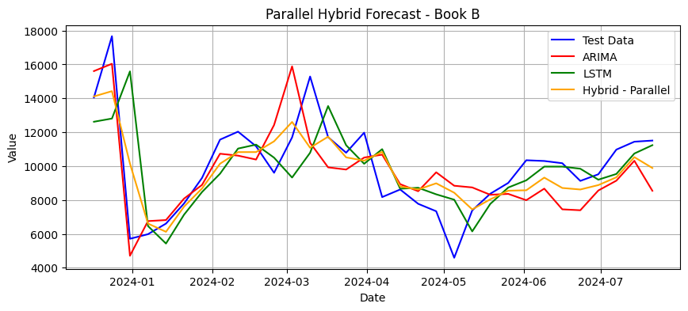

# Time Series Analysis & Sales Forecasting for Book Data

This repository contains a detailed time series analysis of historical book sales data. The primary goal is to identify underlying patterns, model trends and seasonality, and build robust forecasting models to support data-driven business decisions in the publishing industry.

*__Note on Confidentiality:__ This project was completed as part of my MSc at the University of Cambridge. To comply with academic policy, the raw dataset has been excluded and all specific identifiers (such as book titles) have been anonymized. This notebook serves to demonstrate the analytical and coding methodology. **The anonymized dataset can be shared upon request.** *

---

## Business Problem

Due to high upfront costs and limited resources, smaller publishers often struggle to make data-driven decisions about which titles to support. This project addresses this challenge by analyzing historical sales data to guide smarter procurement, inventory, and investment decisions, ultimately reducing financial risk and improving returns.

---

## Skills & Technologies Demonstrated

* **Forecasting Models:** ARIMA, Auto-ARIMA, XGBoost, LSTM, Sequential & Parallel Hybrid Models
* **Time Series Techniques:** Seasonal Decomposition, Autocorrelation (ACF/PACF) Analysis, Lag Feature Engineering
* **Python Libraries:** Pandas, Statsmodels, Scikit-learn, TensorFlow/Keras, PMDArima
* **Hyperparameter Tuning:** KerasTuner, Grid-Search

---

## Key Findings

* The analysis successfully identified strong yearly seasonality in sales data, with predictable peaks and troughs.
* Advanced models like XGBoost and LSTM were highly effective at capturing complex patterns, often outperforming classical ARIMA models.
* The project demonstrates an end-to-end forecasting workflow, from initial data exploration to the implementation and evaluation of multiple advanced modeling techniques.

A sample comparison between classical models (ARIMA) and Deep Learning Based models (Long Short-Term Memory, LSTM) is shown in the picture below:

---

## How to Use

The included Jupyter Notebook (`.ipynb`) contains all the code and detailed analysis. While the original dataset cannot be provided publicly, the notebook's outputs and markdown cells showcase the complete methodology and final results.
